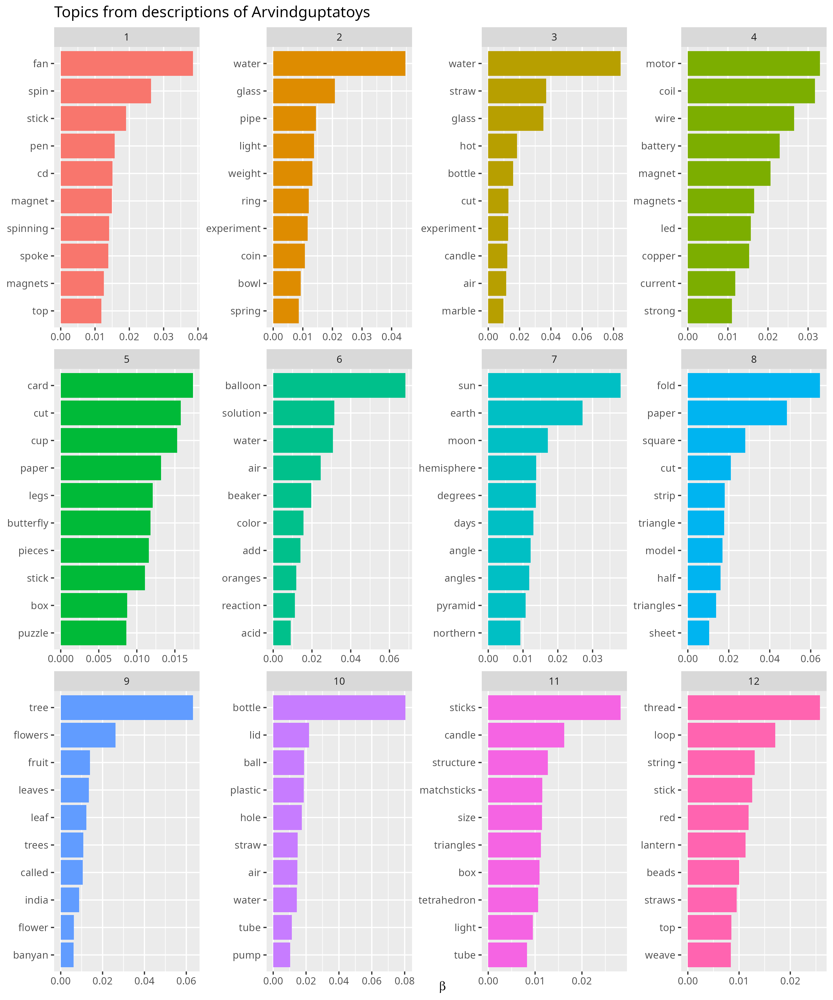

# Data extraction and Analysis: Arvind Gupta toy repository

This repository consists of metadata around 850 videos in Kannada. These videos belong to a repository called the Arvind Gupta toy repository. The repository is being used as part of Sanchari Local: A traveling offline library, being developed for the community mesh network in Hara, Kundapura, Karnataka. More about the work can be found here at: <https://untold.town/magazine/2025/01/sanchari-local-in-hara-early-explorations-of-a-traveling-raspberry-pi-library/>

## Downloading the URLs for all Kannada videos

<https://www.arvindguptatoys.com/films.html> has links to youtube videos and there around 850 Kannada videos. I wrote a bash wget command to get me all the Kannda URLs with the Title and Duration in a csv

```{bash}
# Step 1: Download HTML
wget -O page.html https://www.arvindguptatoys.com/films.html

# Step 2: Extract YouTube links, titles, and durations
grep -i "KANNADA" page.html | grep -oP 'href="([^"]+)"[^>]*>(.*?)<\/a>\s*\(([^)]+)\)' > extracted.txt

# Step 3: Format and save to CSV
echo "Title, URL, Duration" > films.csv
sed -n 's/.*href="\([^"]*\)".*>\([^<]*\)<.*(\([^)]*\)).*/\2, \1, \3/p' extracted.txt >> films.csv
```

## Yt-dl for videos, descriptions, thumbnails and titles

1.  **scrape-youtube/scrape.py:** Scrape descriptions from the URLs and download the videos to a desired path.
2.  **scrape-youtube/scrape_titles.py:** Scrape the YouTube titles for all these URLs and create a path column as per that connects each video it its path to the download folder from previous script
3.  **scrape-youtube/scrapeimages.py:** Scrape images of the YouTube thumbnails for all these URLs if required
4.  **scrape-youtube/cleanup.py:** Clean up the data to remove the videos that do not exist or have error an in getting descriptions

## Convert csv to JSON

```{bash}
csvtojson allvideos_cleaned.csv > allvideos_cleaned.json
```

## Categorizing the videos

Rmd file: **tidy-text-agtoys/Topic modelling.Rmd**

This script performs topic modeling on video descriptions using Latent Dirichlet Allocation (LDA). It begins by loading JSON data, preprocessing text (tokenization, stopword removal), and constructing a document-term matrix (DTM). Word frequencies, TF-IDF scores, and word-pair relationships are analyzed and visualized. The LDA model extracts key topics (I tested with etracting 24 topics, 12 topics, 10 topics and 8 topics), assigns dominant topics to descriptions, and visualizes topic distributions. Finally, the results are compiled for further interpretation and analysis.

### {width="494"}

### Folder structure:

**tidy-text-agtoys/data:** Raw data files - allvideos_cleaned.json which is the base JSON file we will be analyzing, categories.csv which is the category names for the topics generated based on the themes visible.

**tidy-text-agtoys/data export:** CSV files exported during the process of categorizing.

**tidy-text-agtoys/Images:** Images exported while categorizing.
